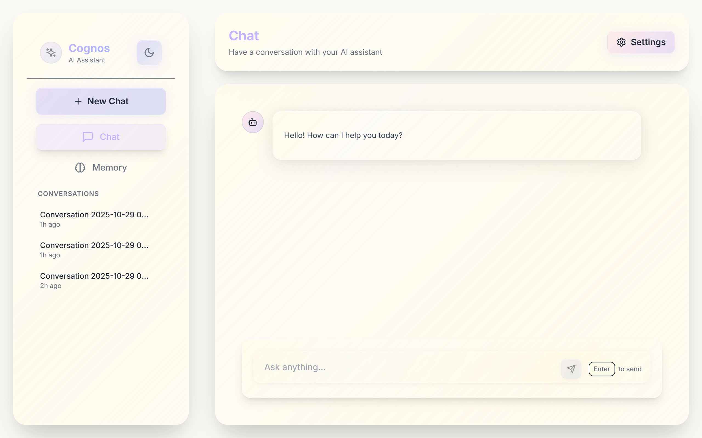
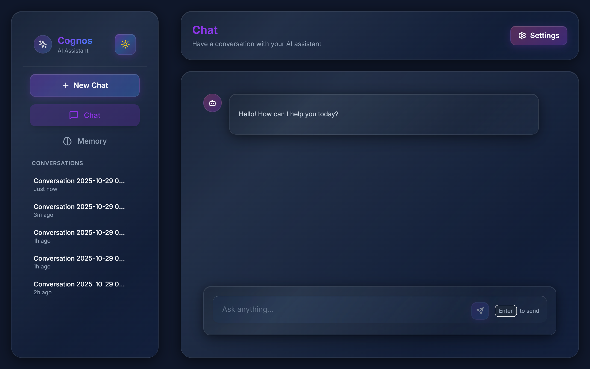
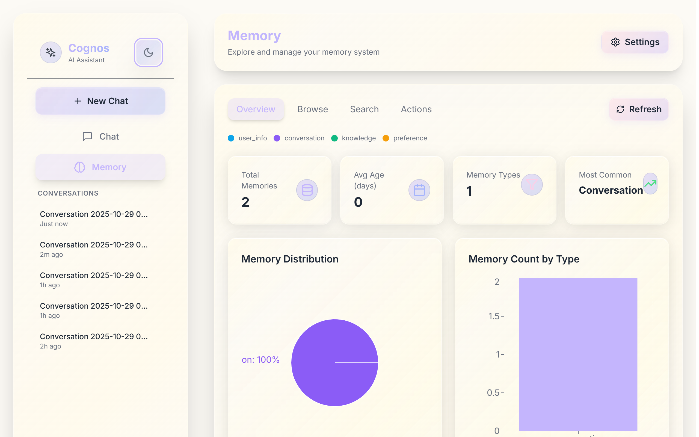
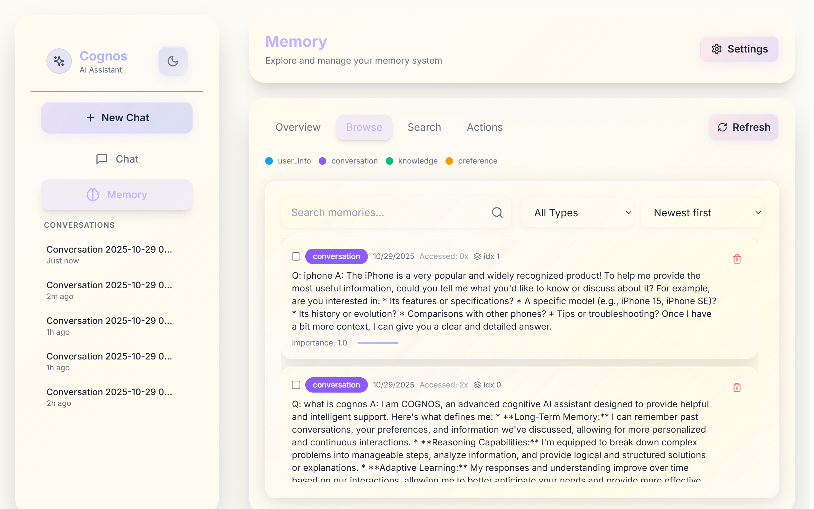
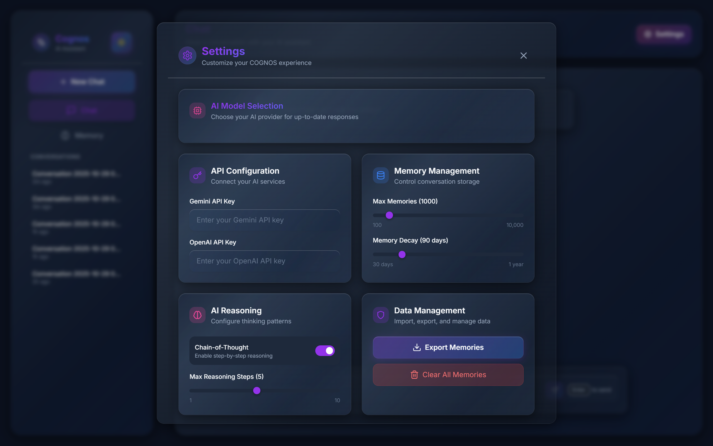

<div align="center">

# COGNOS: 

An elegant, privacy‑first AI assistant with local long‑term memory, multi‑model routing, and a polished React UI.

[](./LICENSE)


</div>

## Overview

COGNOS pairs a FastAPI backend with a modern React + Vite frontend to deliver a snappy, memory‑augmented AI experience. All data is stored locally by default for a privacy‑first workflow.

- Backend: FastAPI (Python 3.11)
- Frontend: React + Vite + TailwindCSS
- Memory: FAISS (local, file‑backed)
- Models: Gemini (default), OpenAI, Ollama

API docs: http://localhost:8000/docs

Note: Docker files have been removed; this README documents the non‑Docker setup.

## Table of contents

- Features
- Screenshots
- Quick start
- Configuration
- API overview
- Project structure
- Troubleshooting
- Contributing
- License and contact

## Features

AI and memory
- Multi‑model support: Gemini, OpenAI, and local models via Ollama
- Long‑term memory with FAISS vectors (stored under `backend/data/`)
- Context builder and optional chain‑of‑thought reasoning
- Local JSON conversation storage (privacy‑first)

API and platform
- REST + WebSocket chat endpoints
- Rate limiting, structured logging, metrics, and cache endpoints
- OpenAPI/Swagger docs at `/docs`
- CORS preconfigured for http://localhost:3000 and http://localhost:5173

UI/UX
- Glassmorphic theme, dark mode, responsive layout
- Conversation history sidebar, settings panel with model selection
- Memory dashboard with search, filters, sorting, bulk delete, and export

## Screenshots

> Light Home


> Dark Home


> Memory Dashboard


> Memory Dashboard (Browse)


> Settings


## Quick start (Windows PowerShell)

Prerequisites
- Python 3.11+
- Node.js 18+
- One LLM provider configured: Gemini API key, OpenAI API key, or a running Ollama server

### 1) Backend

```powershell
cd backend

# Create and activate venv
python -m venv .venv
.\.venv\Scripts\Activate.ps1

# Install dependencies
pip install -r requirements.txt

# Create env file
Copy-Item .env.example .env

# Edit .env and set at least one of these
# DEFAULT_MODEL=gemini
# GEMINI_API_KEY=your_key_here
# OPENAI_API_KEY=your_key_here
# OLLAMA_BASE_URL=http://localhost:11434

# Run the API (http://localhost:8000)
python -m app.main
```

### 2) Frontend

```powershell
cd frontend
npm install

# Optional: point UI to your API (defaults to http://localhost:8000)
$env:VITE_API_URL = "http://localhost:8000"

# Start Vite dev server (http://localhost:3000)
npm run dev
```

## Configuration

Backend env (`backend/.env`)

```env
# LLM API Keys
GEMINI_API_KEY=your_gemini_api_key
OPENAI_API_KEY=your_openai_api_key

# Model Settings
DEFAULT_MODEL=gemini  # gemini | openai | ollama
GEMINI_MODEL=gemini-2.5-flash
GEMINI_EMBEDDING_MODEL=models/text-embedding-004
OPENAI_EMBEDDING_MODEL=text-embedding-3-small
OLLAMA_BASE_URL=http://localhost:11434
OLLAMA_EMBEDDING_MODEL=nomic-embed-text

# Memory + limits
VECTOR_DIM=768
MAX_MEMORIES=1000
MEMORY_DECAY_DAYS=90
ENABLE_COT=true
MAX_REASONING_STEPS=5
MAX_CONTEXT_TOKENS=4000
SHORT_TERM_MEMORY_SIZE=10

# Server
HOST=0.0.0.0
PORT=8000
DEBUG=true
CORS_ORIGINS=http://localhost:3000,http://localhost:5173

# Storage paths (local, privacy‑first)
DATA_DIR=data
MEMORY_INDEX_PATH=data/memory_index.faiss
MEMORY_METADATA_PATH=data/memory_metadata.pkl
```

Frontend env (optional)
- `VITE_API_URL` — override API base URL (defaults to `http://localhost:8000`)

## API overview

Key endpoints
- Chat: `POST /api/chat/` and `POST /api/chat/task-plan`
- Conversations: CRUD under `/api/conversations`
- Memory: CRUD + search under `/api/memory`
- Models: list/switch under `/api/models`
- Metrics: `/api/metrics/*`
- Cache: `/api/cache/*`
- Health: `/api/health`, `/api/health/ready`, `/api/health/live`, `/api/health/detailed`

WebSocket
- `ws://localhost:8000/ws/chat`

OpenAPI docs
- http://localhost:8000/docs

## Project structure

```
COGNOS/
├─ backend/
│  ├─ app/
│  │  ├─ api/                 # chat, memory, models, metrics, cache, health, websocket
│  │  ├─ core/                # config, llm_manager, memory_manager, context, reasoning
│  │  ├─ middleware/          # rate limit, logging, error handlers
│  │  └─ main.py              # FastAPI app bootstrap
│  ├─ data/                   # local storage (created at runtime)
│  ├─ requirements.txt
│  └─ .env(.example)
├─ frontend/
│  ├─ src/                    # React app (Vite)
│  ├─ public/
│  ├─ package.json
│  └─ vite.config.js
├─ assets/                    # screenshots used in README
└─ README.md
```

## Troubleshooting

Invalid API key / 401
- Ensure `GEMINI_API_KEY` or `OPENAI_API_KEY` is set (or run Ollama with `OLLAMA_BASE_URL`).

No model available / 500 from `/api/chat/`
- At least one provider must be configured; default model is `gemini`.

CORS errors in browser
- Frontend should run at `http://localhost:3000`; ensure this origin is in `CORS_ORIGINS`.

FAISS install issues (Windows)
- Uses `faiss-cpu==1.12.0` with `numpy==1.26.4`. Use Python 3.11 inside a fresh venv.

Health endpoint from UI
- Health routes live under `/api/health`. If the UI uses `/health`, update it to `/api/health`.

## Contributing

Issues and PRs are welcome. Please open an issue describing bugs or proposals. For larger changes, discuss first to align on scope.

## License and contact

Licensed under MIT — see [LICENSE](./LICENSE).

Questions or feedback? Email: royxlead@gmail.com
